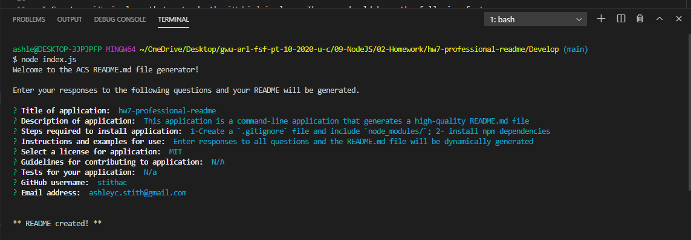

# hw7-professional-readme, 21 JAN 21

#### By Ashley Stith

## Description
This Application is a command-line application that generates a high-quality README.md file.  The application dynamically generates a professional README.md file from user input using the [Inquirer package](https://www.npmjs.com/package/inquirer).  The application is invoked by using the following command:

```bash
node index.js
```

The generated README.md file contains sections for the Description, Table of Contents, Installation, Usage, License, Contributing, Tests, and Questions.  The title of the README.md file will be the project title.

Because the application is not deployed, a video demonstrating its functionality is included.  The video was created using Screencastify and a link to it is included below. A [test README.md file](hw7-professional-readme-README.md) has also been included to show an example of a generated README.md file.

Video demo of the application: *Note: The application may have been slightly updated since recording demo*
[](https://drive.google.com/file/d/1GtlAhnR1HXYaVm09OOuH63dwhw05PoCV/view?usp=sharing)

## Installation
* Create a `.gitignore` file and include `node_modules/` and `.DS_Store/`
* Install npm dependencies using the following command:
```bash
node i --save
```

## Known Bugs
Site has no known bugs

## Technologies Used
* node.js
* inquirer.js

## Contribution Guidelines
Direct link to repository: https://github.com/stithac/hw7-Professional-Readme/


